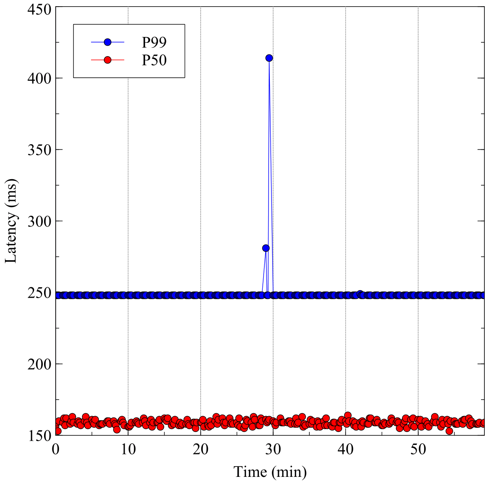
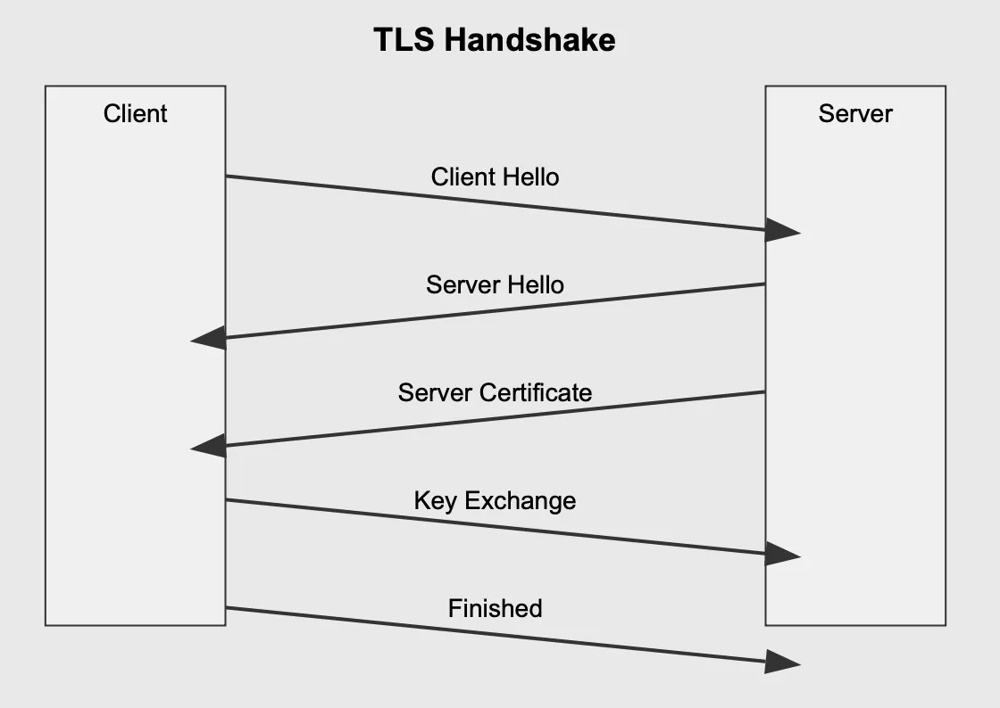
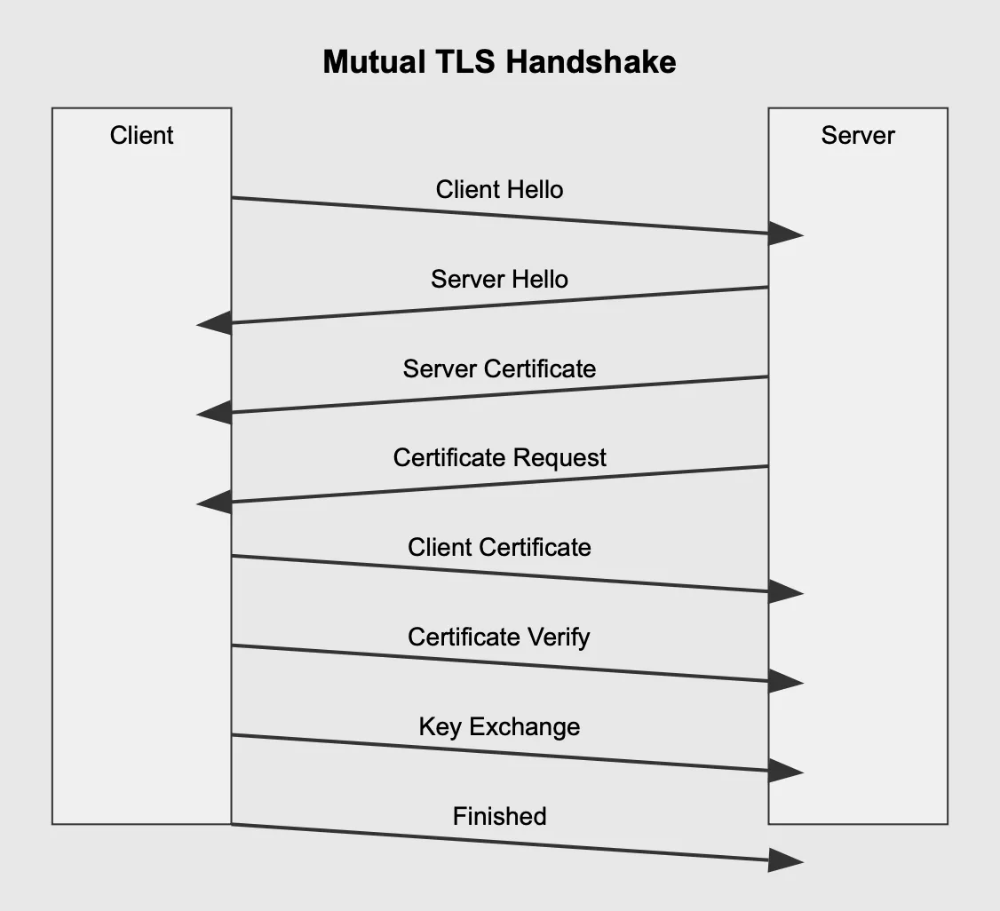

# Delve into Overheads of Service Mesh's mTLS

### 
 mTLS_On

</img>

### 
 mTLS_Off

</img>

### 
 TLS_handshake_process

</img>
                    
### 
 mTLS_handshake_process

</img>

REFERENCES  
Sangwon Lim, Hyeonmin Lee, Hyunsoo Kim, Hyunwoo Lee, Ted "Taekyoung" Kwon, "ZTLS: A DNS-based Approach to Zero Round Trip Delay in TLS handshake," in _Proc. of ACM WWW_, April 2023.
